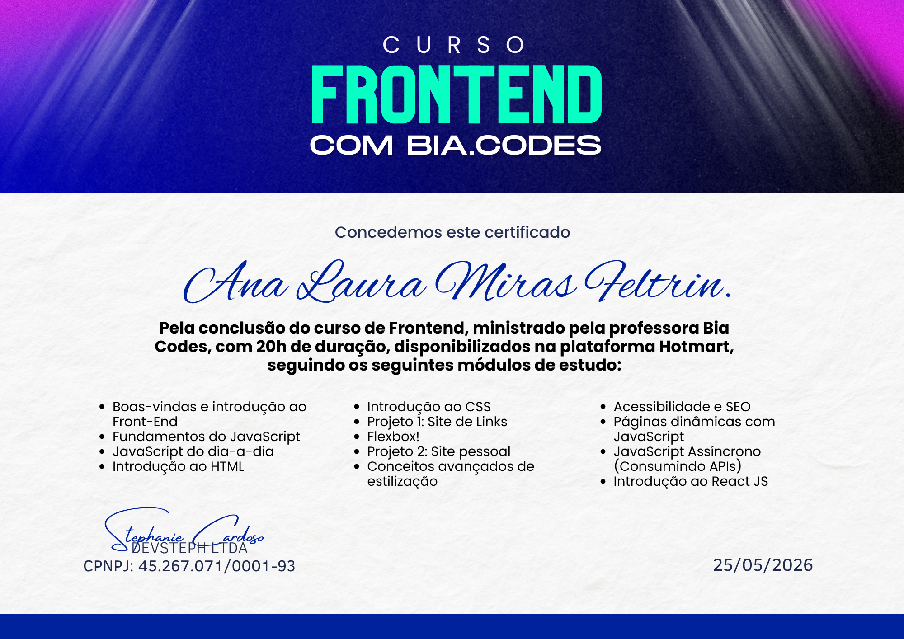

# 📁 Estudos — Curso Frontend com Bia Codes

> *Onde tudo começou. Este repositório guarda cada aula e cada "agora entendi!" da minha entrada no mundo do front-end.*

---

## 💡 Sobre este repositório

Este repositório reúne todos os arquivos de estudo do curso Frontend com Bia Codes (Comunidade Dev Completo). 
Foi meu primeiro contato com o desenvolvimento front-end. Com 20h de conteúdo, o curso me levou do zero até uma introdução ao React, passando por HTML, CSS, JavaScript e muito mais.

Aqui não tem projeto finalizado nem código perfeito. Tem só o meu aprendizado, organizado por módulo e aula, do jeito que foi acontecendo.

---

## 📂 Estrutura do repositório

- 📁 HTML
- 📁 CSS
- 📁 JAVA SCRIPT
- 📁 ReactJS
- 📁 PROJETO SITE DE LINKS
- 📁 projeto-portfolio
- 📁 DICAS

Cada pasta contém subpastas organizadas por aula (Aula 01, Aula 02...), com os exercícios e experimentos feitos durante o curso.

---

## 🛠️ Tecnologias estudadas

- **HTML5** — estrutura e semântica
- **CSS3** — estilização, Flexbox e conceitos avançados
- **JavaScript Vanilla (ES6+)** — fundamentos, dia-a-dia, páginas dinâmicas e JS assíncrono (consumo de APIs)
- **SEO e Acessibilidade** — boas práticas para a web
- **ReactJS** — introdução à biblioteca

---

## 📜 Módulos do curso

- Boas-vindas e introdução ao Front-End
- Introdução ao HTML
- Introdução ao CSS
- Flexbox
- Conceitos avançados de estilização
- Projeto 1: Site de Links
- Projeto 2: Site Pessoal (posteriormente adaptado para o React, [neste repositório](https://github.com/analaurafeltrin/portfolio-ana-laura-react)) 
- Fundamentos do JavaScript
- JavaScript do dia-a-dia
- Páginas dinâmicas com JavaScript
- JavaScript Assíncrono — Consumindo APIs
- Acessibilidade e SEO
- Introdução ao React JS

---

## 🏆 Certificado de conclusão

---

## 👤 Autor

Feito por **Ana Laura Feltrin** • [LinkedIn](https://www.linkedin.com/in/analaurafeltrin) • [GitHub](https://github.com/analaurafeltrin)
